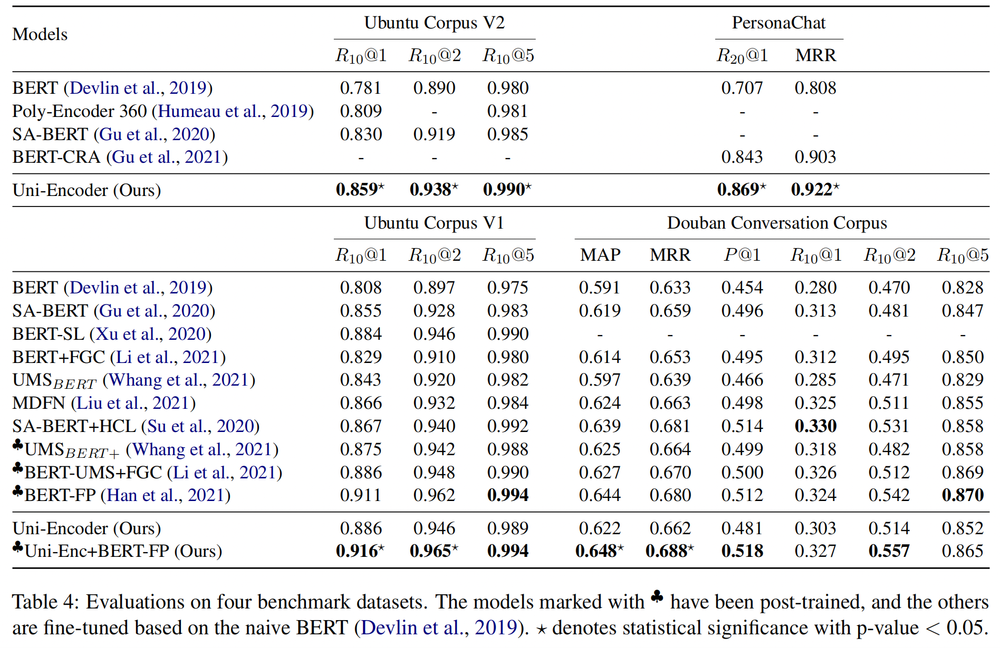

# Uni-Encoder
This code can be used to reproduce the results of *Uni-Encoder: A Fast and Accurate Response Selection Paradigm for Generation-Based Dialogue Systems* on PersonaChat, Ubuntu V1, Ubuntu V2, and Douban datasets. (Our [paper](https://arxiv.org/abs/2106.01263) has been accepted by the Findings of ACL 2023.)




## Dependencies
The code is implemented using python 3.8 and PyTorch v1.8.1(please choose the correct command that match your CUDA version from [PyTorch](https://pytorch.org/get-started/previous-versions/))

Anaconda / Miniconda is recommended to set up this codebase.

There are only minor differences between the model files named "uni_encoder.py" in different directories, e.g., the pre-trained model used for the Douban corpus is "Bert-base-Chinese", not the English version.

You may use the command below(cuda 11+):
```shell
conda create -n UniEncoder python=3.8

conda activate UniEncoder
cd Uni-Encoder

pip install torch==1.8.1+cu111 torchvision==0.9.1+cu111 torchaudio==0.8.1 -f https://download.pytorch.org/whl/torch_stable.html

pip install -r requirements.txt
```

## Training
Within this repository, we have included the code trained on the Ubuntu (v1 and v2), Persona-Chat, and Douban datasets. To facilitate reproduction, I have divided the code into three separate folders, and they all share a common model file, ```uni_ecoder.py```.

We have uploaded standardized data. You can download from here:
- [Ubuntu v1](https://westlakeu-my.sharepoint.com/:u:/g/personal/hehongliang_westlake_edu_cn/EXejdCChVONFv6R_DgvmyR4BRSbUdNoA8qm_-FKU9OvUNA?e=baIYPK) (Please put the dataset in the "ubuntu/data".)
- [Ubuntu v2](https://westlakeu-my.sharepoint.com/:u:/g/personal/hehongliang_westlake_edu_cn/ETGtMXxxnzVJsOMZs5NHMj8B4MJEKBJmvwkrVMzY14JeoA?e=LvrfSk) (Please put the dataset in the "ubuntu/data".)
- [Persona Chat](https://westlakeu-my.sharepoint.com/:u:/g/personal/hehongliang_westlake_edu_cn/EY1dhGDfvkVMoVeou2iDfWIBwa70WiifBGIULatHk4j3UQ?e=UGBXJs) (Please put the dataset in the "persona-chat/data".)
- [Douban](https://westlakeu-my.sharepoint.com/:u:/g/personal/hehongliang_westlake_edu_cn/EcnXo_kdxixDu6l9Kd0yhFoBhXbQlxEr9W73K9Ha2EMVHQ?e=ktxwrF) (Please put the dataset in the "douban/data".)

I have included a running script in each folder. 

For instance, in the ubuntu folder, there is a  ```run_dist.sh``` :
```bash
export CUDA_VISIBLE_DEVICES=0,1,2,3,4,5
nohup python -m torch.distributed.launch --master_port 1234 --nproc_per_node=6 train_dist.py \
       --data_path data/UbuntuV2_data.json \
       --train_batch_size 8 \
       --valid_batch_size 8 \
       --gradient_accumulation_steps 1 \
       --num_workers 24 \
       --scheduler noam \
       --n_epochs 20 \
       --lr 2e-4 > logs.out &
```

Run the script to train the Uni-Encoder:
```bash
cd ubuntu
bash run_dist.sh
```


You can adjust the batch size and the number of gpu based on your own device. During the first run, the data needs to be read and tokenized, which may cause some delays. However, from the second run onwards, the dataset is stored in the cache folder, and you can accelerate the process by adding the ```--dataset_cache```.

If you want to continue training on the post-trained [BERT-FP(Han et al.)](https://aclanthology.org/2021.naacl-main.122/) model, you need to first download the post-trained checkpoint from [here](https://github.com/hanjanghoon/BERT_FP) and place it in the "post_training_model" folder. Then use ```--use_post_training bert_fp```.

During training, the model is saved after each epoch, and you can find the "xxx.pt" model and the "training.log" file containing the details of the training in the "runs" directory. If an error occurs, the error message will be displayed in the "logs.out" file.

## Inference 
- We have uploaded standardized data and model checkpoints. Please refer to the "Training" section to download the processed dataset. Checkpoints download instructions are provided below.

- In the following command, ```--model_checkpoint``` specifies the path of the checkpoint. If you want to perform inference on your trained model, you can modify the path to your own model folder.

### PersonChat

- First, please download the processed data and [model checkpoint (about 389M)](https://westlakeu-my.sharepoint.com/:u:/g/personal/hehongliang_westlake_edu_cn/EVB9Gi_cmXdEvQNE_YN7w-MBAv751am1G-zmRlfr2xIqeQ?e=XhfgFc).
- Inference
    ```shell
    unzip checkpoint_for_PersonaChat.zip -d persona-chat/
    cd persona-chat/
    python test.py --model_checkpoint checkpoint_for_PersonaChat
    ```

### Ubuntu V1 and V2

- First, please download the processed data and [model checkpoints (about 1.14G)](https://westlakeu-my.sharepoint.com/:u:/g/personal/hehongliang_westlake_edu_cn/EVtRu4j7HCpGhAiCCn8v8acB8ANGsSwvAmyybWSkaEb0SA?e=o9G6EM).

- Inference
    ```shell
    unzip checkpoint_for_Ubuntu.zip -d ubuntu/
    cd ubuntu/

    # inference on Ubuntu V1
    python test.py --data_path data/UbuntuV1_data.json --model_checkpoint checkpoint_for_UbuntuV1

    # inference on Ubuntu V2
    python test.py --data_path data/UbuntuV2_data.json --model_checkpoint checkpoint_for_UbuntuV2

    # inference on Ubuntu V1(finetune from the checkpoint given by BERT-FP)
    python test.py --data_path data/UbuntuV1_data.json --use_post_training bert_fp --model_checkpoint checkpoint_for_UbuntuV1_use_bert_FP
    ```

### Douban

- First, please download the processed data and [model checkpoint (about 729M)](https://westlakeu-my.sharepoint.com/:u:/g/personal/hehongliang_westlake_edu_cn/EVF2RYknM6NBrl0_yhKf-moBCIq97Jg_qHHrrhqjqJKIIQ?e=FQjG3r).
- Inference
    ```shell
    unzip checkpoint_for_Douban.zip -d douban/
    cd douban/

    # inference on Douban
    python test.py --model_checkpoint checkpoint_for_Douban

    # inference on Douban(finetune from the checkpoint given by BERT-FP)
    python test.py --use_post_training bert_fp --model_checkpoint checkpoint_for_Douban_use_bert_FP
    ```

